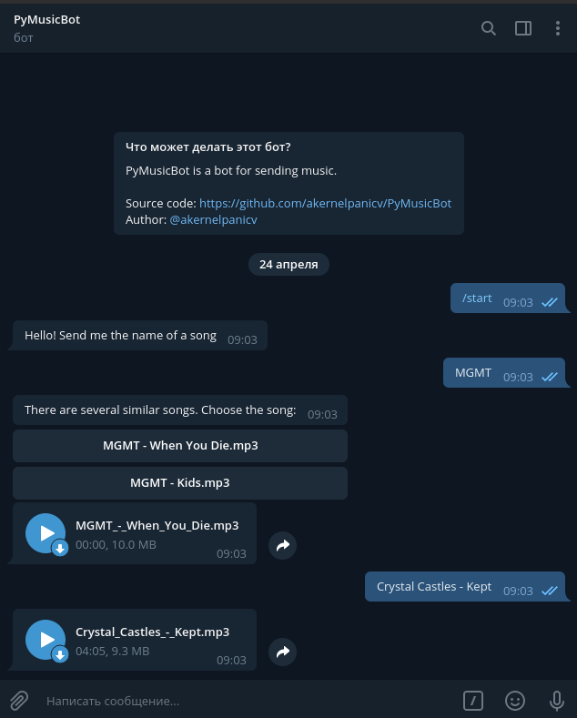
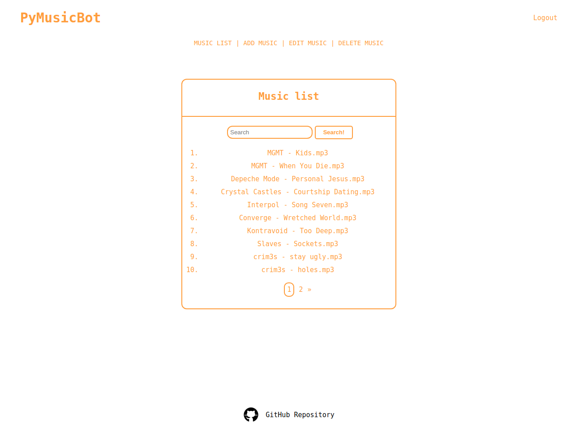

# PyMusicBot

Telegram bot with admin panel on flask for sending music

---

### **Telegram bot**

### **Admin panel**

---

### **Getting started**

0. Run init.sh
1. In postgresql you need to create a user and a database, then write this data to settings.cfg and to telegram_bot/.env
2. Get a token from @BotFather, then write this token to the .env file
3. In a virtual environment: `pip install -r requirements.txt`
4. Run migrate.sh
5. Set the value of the env variable "PyMusicBot_SETTINGS" to "settings.cfg", then run create_admin.py.  
6. Run start.sh for admin panel or telegram_bot/bot.py

######Your login in admin panel - root, password - toor